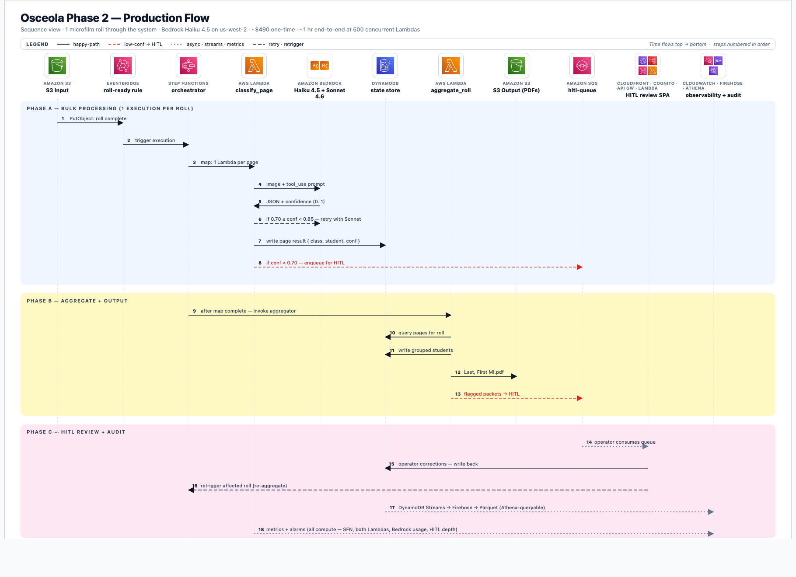
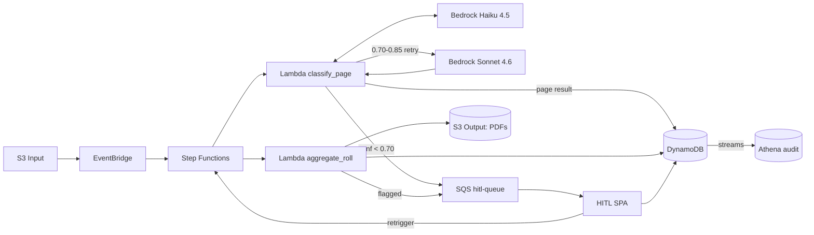
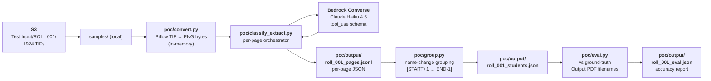

# Osceola POC — Student Records AI Pipeline

AI pipeline to classify and extract data from **218,577 TIF scans** (verified via full S3 inventory, matches SOW exactly) of student records on S3, producing named PDFs per student (`Last, First Name MI.pdf`) grouped into their original microfilm roll folders.

Client: Osceola County School District.
Source: `s3://servflow-image-one/Osceola Co School District/` (us-west-2).
Model: TBD pending bake-off — candidates include Amazon Nova Lite, Nova Pro, Claude Haiku 4.5. Bedrock vision only — no Textract.

**Data notes (2026-04-20 audit):**
- 100 rolls across 7 districts. Gaps: ROLL 048, 100. Splits: 065B, 075A. Partials: 059, 101.
- Ground truth exists for **D1 only** (7 rolls, 3,128 real PDFs). Districts 2–7 have zero ground truth.
- `Test Input/` is byte-identical to `Input/ROLL 001|012|076/` — not a held-out test set. `Test Output/` is empty.
- ~14% of ground-truth filenames have placeholder tokens or embedded OCR garbage — eval must apply a cleaning pass first.

---

## Problem

~218K TIF images, one per scanned microfilm frame, across 7 districts × 101 rolls (≈2,000 frames per roll). Each roll is a linear scan of a physical 1991–92 microfilm reel. Student packets are back-to-back with no per-student separator pages — boundaries must be inferred from name changes. Two different filming vendors used different leader + separator-card layouts.

Output target: **~43,000 student PDFs** (revised 2026-04-20 from D1 PDF/TIF size ratio at ~5.1 pages/student; earlier 48,600 figure was based on a 4.5-pages estimate), named `Last, First MI.pdf`, one per student, with 90–95% name-extraction accuracy and a human-in-the-loop queue for low-confidence cases.

---

## Canonical roll structure

```
Frame 00001 … 0000N     roll_leader — variable length (3–7 frames)
  00001                 blank / vendor letterhead / microfilm resolution target
  00002…0000(N-1)       operator card, certification card, district title page
  0000N                 roll_separator (START clapperboard OR certificate card)

Frame 0000N+1 … M-1     student packets, back-to-back
                         grouped by name-change detection

Frame M                 roll_separator (END clapperboard OR certificate card)
Frame M+1 … last        roll_leader — trailing blank / letterhead
```

Two visually distinct separator-card styles — both classify as `roll_separator`:

| Style | Look | Districts |
|---|---|---|
| A — clapperboard | diagonal-hatched rectangles + "START/END" + boxed handwritten `ROLL NO. N` | 2, 4, 5, 6, 7 |
| B — certificate | printed "CERTIFICATE OF RECORD" form + START/END heading + filmer signature | 1, 3 |

## Page taxonomy (6 classes)

- `student_cover` — primary cumulative/guidance record (name + demographics)
- `student_test_sheet` — standardized test form with student name
- `student_continuation` — back page, comments, family data with name at top
- `roll_separator` — START or END card (either style)
- `roll_leader` — blank, vendor letterhead, calibration target, district title, certification card, operator card
- `unknown` — blank mid-roll, illegible

---

## Production architecture (Phase 2+)



**Editable source:**
- HTML (canonical): [`diagrams/phase2_arch.html`](diagrams/phase2_arch.html)
- Figma (interactive): https://www.figma.com/design/mCTwHS2SO9073tSu1NI3yv

<details>
<summary>Mermaid fallback (collapsed)</summary>


</details>

### Accuracy strategy (target 90–95%)

Five stacked layers — compound effect:

1. **Self-reported confidence** per page + per field from Haiku 4.5
2. **Cross-page validation** — majority-vote name across consecutive pages in same packet
3. **Format validation** — DOB regex, name alpha-only, `ROLL NO.` matches folder context
4. **Sonnet 4.6 fallback tier** — mid-confidence retries only (~10–15% of pages)
5. **HITL review** — residual <5% sent to human operators

### Cost estimate (one-time 218K run)

| Line item | Cost |
|---|---|
| Bedrock Haiku (Batch Inference) | ~$225 |
| Bedrock Sonnet (retry tier) | ~$150 |
| Lambda invocations | ~$50 |
| Step Functions | ~$20 |
| DynamoDB on-demand | ~$10 |
| S3 + transfer | ~$30 |
| **AWS total** | **~$490** |

Plus operator HITL time (~90 hrs estimated at 5% review rate × 30s per page).

---

## Phase 1 POC architecture (current scope)

Local Python, no AWS infra. Prove accuracy before building production stack.



Success criterion: `accuracy_partial ≥ 0.85` on ROLL 001.

---

## Repo layout

```
├── main.py                     # interactive S3 helper CLI (current)
├── s3_operations.py            # boto3 wrappers for S3 list/upload/download/read/delete
├── requirements.txt            # boto3, pillow, pydantic, pytest, Levenshtein
├── CLAUDE.md                   # guidance for AI coding assistants
├── README.md                   # you are here
├── .env.example                # AWS creds template
├── docs/
│   ├── osceola-poc-discussion.md         # project discovery notes (source of truth)
│   └── superpowers/
│       ├── specs/2026-04-18-osceola-phase1-poc-design.md   # Phase 1 design spec
│       └── plans/2026-04-18-osceola-phase1-poc.md          # 12-task TDD plan
├── samples/
│   └── fixtures_public/        # 3 non-PII fixtures (separator cards + calibration target)
│                               # Full sample set stays in S3 (FERPA-protected).
└── poc/                        # (to be created per plan) — classify + extract + group + eval
```

---

## Quick start

```bash
# install deps
pip install -r requirements.txt

# configure AWS
cp .env.example .env
# edit .env with AWS creds + set S3_BUCKET_NAME=servflow-image-one, AWS_REGION=us-west-2

# run the S3 helper CLI
python main.py
```

POC pipeline scripts not yet written — see [`docs/superpowers/plans/2026-04-18-osceola-phase1-poc.md`](docs/superpowers/plans/2026-04-18-osceola-phase1-poc.md) for the 12-task TDD build order.

---

## Roadmap

| Phase | Scope | Duration |
|---|---|---|
| **1 — POC** (current) | Python pipeline on ROLL 001, measure accuracy | 2 weeks |
| **2 — Single-roll prod** | Step Functions + Lambda + DynamoDB for one roll end-to-end + PDF output | 2 weeks |
| **3 — HITL UI** | React SPA + Cognito + API Gateway for operator review | 2 weeks |
| **4 — Bulk 218K** | Bedrock Batch Inference, monitoring, security hardening, full dataset run | 2 weeks |

---

## Data source

FERPA-protected student records. Real TIFs are NOT in this repo — they live in S3 (`servflow-image-one`, us-west-2) with IAM-gated access. The three images in `samples/fixtures_public/` are separator cards and a calibration target that contain no student PII.

Known data caveat: the S3 folder number (e.g. `ROLL 101`) does not always match the original microfilm reel number on the certification card (`Reel 756` in one observed case). Use the certification card's reel number when referencing the original archive.

---

## Known blockers

1. **IAM Bedrock permissions missing** — the current `Servflow-image1` IAM user cannot call `bedrock:*` APIs. Must be resolved before Phase 1 Task 5. Grant policy or issue a new role.

---

## License

Private internal project. No license granted.
