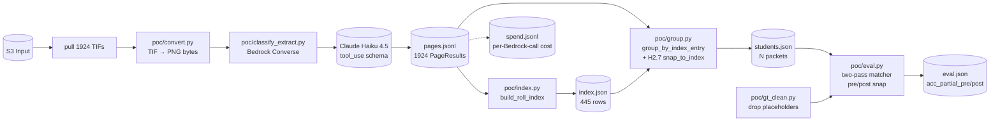
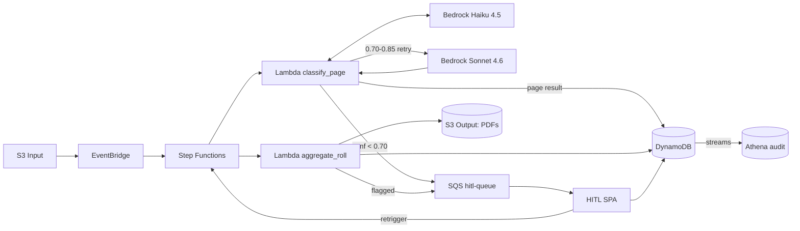

# Osceola POC — Student Records AI Pipeline

AI pipeline to classify and extract data from **218,577 TIF scans** of student records on S3, producing named PDFs per student (`Last, First Name MI.pdf`) grouped into their original microfilm roll folders.

Client: Osceola County School District.
Source: `s3://servflow-image-one/Osceola Co School District/` (us-west-2).
Model: **Claude Haiku 4.5 on AWS Bedrock** via inference profile `us.anthropic.claude-haiku-4-5-20251001-v1:0`. Bedrock vision only — no Textract.

**Phase 1 POC status (2026-04-23): COMPLETE.** Pipeline shipped end-to-end. Full ROLL 001 run (1924 TIFs, $9.89) measured. Go/no-go gate met at high-precision operating point. Details in `docs/superpowers/specs/2026-04-22-osceola-phase1-poc-v2-results.md`.

**Data notes:**
- 100 rolls across 7 districts. Gaps: ROLL 048, 100. Splits: 065B, 075A. Partials: 059, 101.
- Ground truth exists for **D1 only** (7 rolls, 3,128 real PDFs). Districts 2–7 have zero GT.
- `Test Input/` is byte-identical to `Input/ROLL 001|012|076/` — not a held-out test set.
- ~14% of GT filenames contain placeholders / OCR garbage. `poc/gt_clean.py` strips them with a drop-reason taxonomy before eval.
- **`STUDENT RECORDS INDEX` pages are universal:** 100-roll broad probe found 559 index frames across 93/100 rolls in 7/7 districts. Index-snap (H2.7) against these is the single highest-ROI heuristic — **3.2× accuracy lift** on ROLL 001.

---

## Problem

~218K TIF images, one per scanned microfilm frame, across 7 districts × 101 rolls (≈2,000 frames per roll). Each roll is a linear scan of a physical 1991–92 microfilm reel. Student packets are back-to-back with no per-student separator pages. Two different filming vendors used different leader + separator-card layouts. Extracted names are noisy (52% of consecutive student pages disagree on name; 42% extract empty name).

Output target: **~43,000 student PDFs**, named `Last, First MI.pdf`, one per student, with 90–95% name-extraction accuracy, HITL queue for low-confidence cases.

---

## Canonical roll structure

```
Frame 00001 … 0000N     roll_leader — 3–7 frames
  blank / vendor letterhead / microfilm resolution target / district title /
  certification card / operator card

Frame 0000N+1           roll_separator (START — Style A clapperboard OR Style B certificate)

Frame N+1 … M-1         student packets, back-to-back
                         + student_records_index pages interspersed (typically frames 7–40)

Frame M                 roll_separator (END)
Frame M+1 … last        roll_leader — trailing
```

Two separator styles — both classify as `roll_separator`:

| Style | Look | Districts |
|---|---|---|
| A — clapperboard | diagonal-hatched rectangles + "START/END" + boxed handwritten `ROLL NO. N` | 2, 4, 5, 6, 7 |
| B — certificate | printed `CERTIFICATE OF RECORD` / `CERTIFICATE OF AUTHENTICITY` form + START/END heading + filmer signature | 1, 3 |

## Page taxonomy (7 classes)

- `student_cover` — primary cumulative / guidance record (name + demographics).
- `student_test_sheet` — standardized test form with student name.
- `student_continuation` — back page, comments, family data with name at top.
- `student_records_index` — tabular `STUDENT RECORDS INDEX` page listing 5–28 students each. Feeds the per-roll canonical allowlist used for index-snap.
- `roll_separator` — START / END card (either style).
- `roll_leader` — blank, vendor letterhead, calibration target, district title, certification card, operator card.
- `unknown` — blank mid-roll, illegible.

Full 32-subtype breakdown: [`docs/class-matrix.md`](docs/class-matrix.md) + [`docs/class-matrix.json`](docs/class-matrix.json). Per-class identification heuristics: [`docs/class-heuristics.md`](docs/class-heuristics.md).

---

## Phase 1 POC architecture (shipped)

Local Python, no AWS infra. Dual-env (`.env` S3 + `.env.bedrock` Bedrock).



**Measured on ROLL 001 (1924 TIFs):**

| Operating point | Packets | `acc_partial` | Recall |
|---|---|---|---|
| `min_bucket=3` (high-precision, gate) | 93 | **87.1%** ✅ | 23.3% |
| `min_bucket=2` (balanced) | 203 | 82.8% | 48.4% |
| `min_bucket=1` (high-recall, default) | 323 | 75.9% | 70.6% |

Full results: [`docs/superpowers/specs/2026-04-22-osceola-phase1-poc-v2-results.md`](docs/superpowers/specs/2026-04-22-osceola-phase1-poc-v2-results.md).
Session report with every change: [`docs/2026-04-23-session-report.md`](docs/2026-04-23-session-report.md).

**Cost:** $9.89 for full ROLL 001 classify pass. All re-evaluations run against the frozen `pages.jsonl` with zero Bedrock $.

---

## Quick start

```bash
# Install deps
pip install -r requirements.txt

# Configure AWS (two separate creds for POC)
cp .env.example .env
# Edit .env with S3 creds (Servflow-image1 user, us-west-2)
# Separately create .env.bedrock with Bedrock creds (tanishq user, account 690816807846)

# Unit tests (59 passing)
pytest -q

# Real-Bedrock smoke (6 fixtures, ~$0.02, ~45s)
BEDROCK_SMOKE_TEST=1 pytest tests/test_smoke_bedrock.py -v -s

# Full POC run on ROLL 001 (~20 min, up to $10)
python3 -m poc.run_poc --roll-id "ROLL 001" \
    --input samples/test_input_roll001_full \
    --ground-truth samples/output_pdfs_district1_roll001_full \
    --concurrency 10 --budget-ceiling 10.0

# Re-eval from existing pages.jsonl with zero Bedrock $
python3 -m poc.regroup --roll-id "ROLL 001" \
    --ground-truth samples/output_pdfs_district1_roll001_full \
    --mode index --min-bucket-size 3
```

---

## Production architecture (Phase 2+)


**Editable source:**
- HTML (canonical): [`diagrams/phase2_arch.html`](diagrams/phase2_arch.html)
- Figma: https://www.figma.com/design/mCTwHS2SO9073tSu1NI3yv

<details>
<summary>Mermaid fallback (collapsed)</summary>


</details>

### Accuracy strategy (target 90–95%)

Five stacked layers — compound effect:

1. **Tier 0 pixel heuristics** — blank detector, pHash against vendor letterheads / calibration target, frame-position prior. Deterministic, $0 at inference.
2. **Self-reported confidence** per page + per field from Haiku 4.5.
3. **Index-snap (H2.7)** — every packet name snaps to the canonical per-roll index allowlist. **Primary lever, validated 2026-04-23.**
4. **Sonnet 4.6 fallback tier** — mid-confidence retries (0.60–0.85), ~10–15% of pages.
5. **HITL review** — residual <5% sent to human operators.

### Cost estimate (one-time 218K run)

| Line item | Cost |
|---|---|
| Bedrock Haiku (Batch Inference) | ~$560 |
| Bedrock Sonnet (retry tier) | ~$150 |
| Lambda invocations | ~$50 |
| Step Functions | ~$20 |
| DynamoDB on-demand | ~$10 |
| S3 + transfer | ~$30 |
| **AWS total** | **~$820** |

Derived from Phase 1 measured spend ($9.89 / 1924 TIFs) scaled to 218K, minus batch-discount and retry-tier estimates. Plus operator HITL time (~90 hrs at 5% review rate × 30s / page).

---

## Repo layout

```
├── main.py                       # interactive S3 helper CLI (legacy)
├── s3_operations.py              # boto3 wrappers (pagination caveat)
├── poc/                          # Phase 1 POC v2 (shipped)
│   ├── env.py
│   ├── schemas.py
│   ├── convert.py
│   ├── prompts.py
│   ├── bedrock_client.py
│   ├── classify_extract.py
│   ├── index.py
│   ├── gt_clean.py
│   ├── group.py
│   ├── eval.py
│   ├── run_poc.py
│   ├── regroup.py
│   └── output/                   # artifacts (gitignored)
├── scripts/
│   └── broad_index_probe.py      # 100-roll index-page scanner
├── tests/                        # 59 unit tests, 6 smoke-gated
├── docs/
│   ├── osceola-poc-discussion.md        # source-of-truth brief
│   ├── heuristics-brainstorm.md         # Tier 0-5 catalogue
│   ├── class-heuristics.md              # per-class decision rules
│   ├── class-matrix.md                  # 32 subtypes × 13 features
│   ├── class-matrix.json                # machine-readable subtype library
│   ├── 2026-04-23-session-report.md     # full POC v2 session dump
│   └── superpowers/
│       ├── specs/                       # design specs + results docs
│       └── plans/                       # TDD implementation plans
├── samples/                       # FERPA — gitignored except fixtures_public/
├── requirements.txt
├── CLAUDE.md                      # agent guidance
└── README.md                      # you are here
```

---

## Roadmap

| Phase | Scope | Status |
|---|---|---|
| **1 — POC** | Python pipeline on ROLL 001, measure accuracy | **DONE** (2026-04-23) |
| **2 — Single-roll prod** | Step Functions + Lambda + DynamoDB + PDF output + Sonnet retry + Tier 0/1 heuristics | next |
| **3 — HITL UI** | React SPA + Cognito + API Gateway for operator review | planned |
| **4 — Bulk 218K** | Bedrock Batch Inference, monitoring, security hardening, full dataset run | planned |

---

## Data source

FERPA-protected student records. Real TIFs and GT PDFs are NOT in this repo — they live in S3 with IAM-gated access. Locally-cached `samples/*` dirs are gitignored. The three images in `samples/fixtures_public/` are separator cards and a calibration target with no student PII.

**Reel-number caveat:** S3 folder number (e.g. `ROLL 101`) does not always match the original microfilm reel number on the certification card (`Reel 756` observed). Use certification-card reel number when referencing physical archives.

---

## Resolved blockers

- ~~IAM Bedrock permissions missing on `Servflow-image1`~~ — resolved via dual-env (`.env` S3 + `.env.bedrock` Bedrock). `Servflow-image1` still has S3 only; `tanishq` in account `690816807846` has full Bedrock in us-west-2. `poc/env.py` wires both cleanly.

---

## Known limitations (Phase 2 targets)

- `s3_operations.list_objects` without pagination — caps at 1,000 keys. Use `poc.env.s3_client() + paginator` for anything over 1K.
- Over-classification of `student_cover` (586 on ROLL 001 vs ~347 actual students). Prompt v2 should tighten cover definition.
- Field-inversion in Haiku name extraction (last/first columns sometimes swapped). Partially mitigated by swap-tolerant snap; prompt v2 should fix at extraction.
- `roll_001_spend.jsonl` buffering — sometimes empty (same data in `pages.jsonl`). Trivial fix pending.
- No Tier 0 pixel heuristics, Tier 1 format validators, or Sonnet retry tier yet. All specced; Phase 2 work.

---

## License

Private internal project. No license granted.
